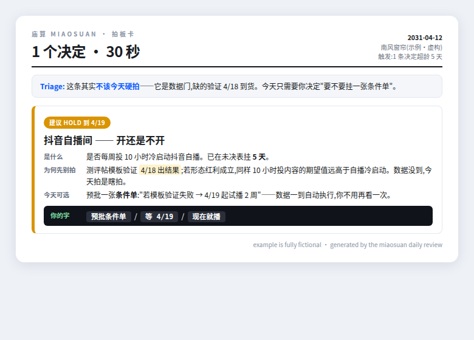
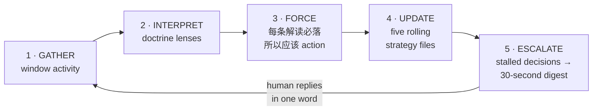

# 庙算 Miaosuan

> 夫未战而庙算胜者，得算多也。——《孙子兵法·计篇》
>
> *"The general who wins the battle makes many calculations in his temple before the battle is fought."*

**An open-source daily strategy-review harness for AI agents.**
**一个每天逼你拍板的开源战略复盘 harness。**

This is **not** another Art-of-War prompt pack. It is a working *harness* — a daily loop that reads what actually happened, interprets it through a pluggable strategic doctrine, forces every insight into an action, and compresses your stalled decisions into a 30-second decision card. The Seven Military Classics (武经七书) ship as its first doctrine pack.

这**不是**又一个兵法 prompt 包。它是一套真的在运转的 harness：每天读取真实发生的事 → 用可插拔的 doctrine 逐条解读 → 强制每条解读落到行动 → 把拖着的决策压成一张 30 秒拍板卡。武经七书是它出厂自带的第一套 doctrine。

---

## What it looks like / 长什么样

When a decision stalls past 3 days, the harness stops analyzing and hands you this — answerable in one word:



*(Example fully fictional. Note what it does: honest triage — it tells you this decision should NOT be forced today, and asks for the one word that actually is needed.)*

## Why a harness, not a prompt / 为什么是 harness 不是 prompt

Ask any LLM "analyze my company with Sun Tzu" and you get an essay. Essays don't run companies. What compounds is a **loop**:



随口问模型"用孙子兵法分析我的公司",你得到一篇作文。作文管不了公司。能复利的是上面这个**循环**——解读被强制落成行动,行动沉淀进滚动的战略文件,拖住的决策被压成 30 秒拍板卡,人的一个字又喂回下一轮。

## What's in the box / 包里有什么

| Path | What it is |
|---|---|
| `SKILL.md` | The daily strategy-review skill (Claude Code / OpenClaw compatible) |
| `templates/strategy/` | The five rolling strategy files: 态势 · 主攻 · 未决 · 红线 · 变更记录 |
| `templates/digest.md` | The "N decisions · 30 seconds" decision card format |
| `doctrines/wujing/` | ★ Flagship pack: Seven Military Classics distilled into 35 operational lenses |
| `books/` | The source layer: full per-chapter study notes of all seven classics (114 files) |
| `doctrines/` | Plugin spec — write your own pack (Stoic? Munger? Boyd?) |
| `examples/` | A full fictional worked example: daily review + decision digest |
| `docs/` | Setup guides |

## Quickstart (≤5 min)

**Fastest path — let your agent install it.** Clone the repo, open your coding agent in your workspace, and paste:

```
I cloned https://github.com/AI-Nate/miaosuan to ./miaosuan.
Install it: copy SKILL.md + doctrines/ + templates/ into this workspace's
skills location (.claude/skills/miaosuan/ for Claude Code), bootstrap
strategy/ from templates/strategy/, then walk me through filling in my
fronts and bets. Finally run a first review over this week.
```

Your agent reads the docs and does the rest. 克隆仓库,把上面这段话丢给你的 agent,它自己会装好并带你跑第一次复盘。

**Manual path:**

1. Clone this repo.
2. Copy `templates/strategy/` into your agent's workspace as `strategy/`.
3. Install `SKILL.md` as a skill — per-platform guides: [`docs/setup-claude-code.md`](docs/setup-claude-code.md) · [`docs/setup-openclaw.md`](docs/setup-openclaw.md) · [`docs/setup-any-agent.md`](docs/setup-any-agent.md) (Cursor, Codex CLI, aider, anything that reads markdown).
4. Run it once manually: *"Run miaosuan over what happened this week."*
5. Wire it to a daily cron. From now on your agent briefs you like a staff officer, not a chatbot.

## The five strategy files / 战略五件套

Rolling files, updated every review — the agent's institutional memory of *strategy*, separate from its memory of *facts*:

- **态势 (Situation)** — where each front stands right now
- **主攻 (Main thrusts)** — the 1–3 bets everything else serves
- **未决 (Pending)** — decisions waiting on the human, with age counters
- **红线 (Red lines)** — things the agent must never do or recommend
- **变更记录 (Changelog)** — every strategy change, dated, one line

## Doctrine packs / doctrine 插件

A doctrine pack = a folder of **lenses**. Each lens: a source quote, a plain-language restatement, *triggering situations*, and a 所以应该 action template. The harness picks the lenses that match the day's events — it never dumps the whole book on you.

Ship your own pack via PR: `doctrines/<your-pack>/`. Spec in [`doctrines/README.md`](doctrines/README.md). Wanted: `stoic/`, `munger/`, `boyd-ooda/`.

## FAQ

**Does this need any API keys or accounts?** No. It's markdown + your existing agent runtime.
**Is my data sent anywhere?** No. Everything stays in your workspace. The harness reads what you give it.
**Why Chinese military classics?** They are the densest decision-making literature ever written for operating under uncertainty with limited resources — and they're public domain.

## Acknowledgments / 致谢

The classical texts in `books/` were studied from the **Chinese Text Project (中国哲学书电子化计划, [ctext.org](https://ctext.org))** — an open-access digital library of pre-modern Chinese texts created by Dr. Donald Sturgeon. Every chapter file links back to its source page there. If this project is useful to you, ctext.org deserves a visit (and [support](https://ctext.org/support)).

`books/` 中七书经文的研读底本来自**中国哲学书电子化计划([ctext.org](https://ctext.org))**——每个篇章文件头部都注明了对应的原文页链接。特此致谢。

## License

Code and skill files: [MIT](LICENSE). Doctrine documents (`doctrines/`): CC-BY-4.0. The classical source texts themselves are public domain; see Acknowledgments for the digital edition used.

---

*Built by running it daily on a real company first. The examples here are fictionalized; the structure is exactly what runs in production.*
