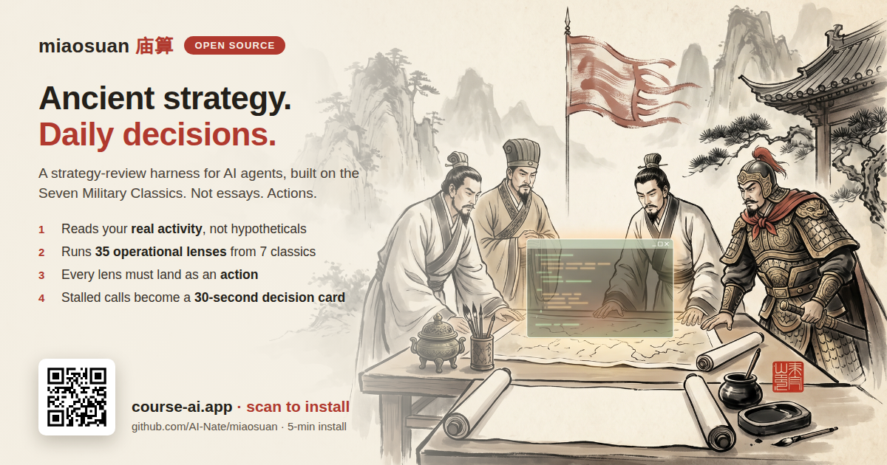
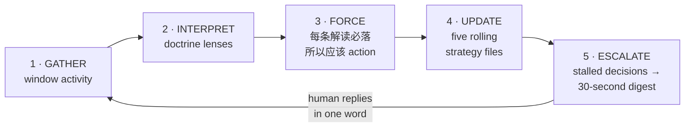

# 庙算 Miaosuan



> 夫未战而庙算胜者，得算多也。——《孙子兵法·计篇》
>
> *"The general who wins the battle makes many calculations in his temple before the battle is fought."*

**An open-source daily strategy-review harness for AI agents.**
**一个每天逼你拍板的开源战略复盘 harness。**

This is **not** another Art-of-War prompt pack. It is a working *harness* — a daily loop that reads what actually happened, interprets it through a pluggable strategic doctrine, forces every insight into an action, and compresses your stalled decisions into a 30-second decision card. The Seven Military Classics (武经七书) ship as its first doctrine pack.

这**不是**又一个兵法 prompt 包。它是一套真的在运转的 harness：每天读取真实发生的事 → 用可插拔的 doctrine 逐条解读 → 强制每条解读落到行动 → 把拖着的决策压成一张 30 秒拍板卡。武经七书是它出厂自带的第一套 doctrine。

---

## What it looks like / 长什么样

When a decision stalls past 3 days, the harness stops analyzing and hands you this — answerable in one word:


*(Example fully fictional. Note what it does: honest triage — it tells you this decision should NOT be forced today, and asks for the one word that actually is needed.)*

## Why a harness, not a prompt / 为什么是 harness 不是 prompt

Ask any LLM "analyze my company with Sun Tzu" and you get an essay. Essays don't run companies. What compounds is a **loop**:



随口问模型"用孙子兵法分析我的公司",你得到一篇作文。作文管不了公司。能复利的是上面这个**循环**——解读被强制落成行动,行动沉淀进滚动的战略文件,拖住的决策被压成 30 秒拍板卡,人的一个字又喂回下一轮。

## What's in the box / 包里有什么

| Path | What it is |
|---|---|
| `SKILL.md` | The daily strategy-review skill (Claude Code / OpenClaw compatible) |
| `templates/strategy/` | The five rolling strategy files: 态势 · 主攻 · 未决 · 红线 · 变更记录 |
| `templates/digest.md` | The "N decisions · 30 seconds" decision card format |
| `doctrines/wujing/` | ★ Flagship pack: Seven Military Classics distilled into 35 operational lenses |
| `books/` | The source layer: full per-chapter study notes of all seven classics (114 files) |
| `doctrines/` | Plugin spec — write your own pack (Stoic? Munger? Boyd?) |
| `examples/` | A full fictional worked example: daily review + decision digest |
| `docs/` | Setup guides |

## Quickstart (≤5 min)

**Fastest path — let your agent install it.** Clone the repo, open your coding agent in your workspace, and paste:

```
I cloned https://github.com/AI-Nate/miaosuan to ./miaosuan.
Install it: copy SKILL.md + doctrines/ + templates/ into this workspace's
skills location (.claude/skills/miaosuan/ for Claude Code), bootstrap
strategy/ from templates/strategy/, then walk me through filling in my
fronts and bets. Finally run a first review over this week.
```

Your agent reads the docs and does the rest. 克隆仓库,把上面这段话丢给你的 agent,它自己会装好并带你跑第一次复盘。

**Manual path:**

1. Clone this repo.
2. Copy `templates/strategy/` into your agent's workspace as `strategy/`.
3. Install `SKILL.md` as a skill — per-platform guides: [`docs/setup-claude-code.md`](docs/setup-claude-code.md) · [`docs/setup-openclaw.md`](docs/setup-openclaw.md) · [`docs/setup-any-agent.md`](docs/setup-any-agent.md) (Cursor, Codex CLI, aider, anything that reads markdown).
4. Run it once manually: *"Run miaosuan over what happened this week."*
5. Wire it to a daily cron. From now on your agent briefs you like a staff officer, not a chatbot.

## The five strategy files / 战略五件套

Rolling files, updated every review — the agent's institutional memory of *strategy*, separate from its memory of *facts*:

- **态势 (Situation)** — where each front stands right now
- **主攻 (Main thrusts)** — the 1–3 bets everything else serves
- **未决 (Pending)** — decisions waiting on the human, with age counters
- **红线 (Red lines)** — things the agent must never do or recommend
- **变更记录 (Changelog)** — every strategy change, dated, one line

## Doctrine packs / doctrine 插件

A doctrine pack = a folder of **lenses**. Each lens: a source quote, a plain-language restatement, *triggering situations*, and a 所以应该 action template. The harness picks the lenses that match the day's events — it never dumps the whole book on you.

Ship your own pack via PR: `doctrines/<your-pack>/`. Spec in [`doctrines/README.md`](doctrines/README.md). Wanted: `stoic/`, `munger/`, `boyd-ooda/`.

## FAQ

**Does this need any API keys or accounts?** No. It's markdown + your existing agent runtime.
**Is my data sent anywhere?** No. Everything stays in your workspace. The harness reads what you give it.
**Why Chinese military classics?** They are the densest decision-making literature ever written for operating under uncertainty with limited resources — and they're public domain.

## 道 · Ethos & responsible use / 立意与负责任使用

The first of Sun Tzu's five factors is **道 (dao)** — the moral alignment that makes people move as one. It comes *before* terrain, weather, command, and method (天·地·将·法). A calculation without it is already a losing one, no matter how many sums you run.

孙子五事,**道**居其首——排在天、地、将、法之前。没有道的算计,算得再多,也是败局。

So the purpose of miaosuan is narrow and deliberate:

- **Build, don't harm.** This harness exists to help you optimize your own life and work — and, through that, make the world a little better for the people around you. It is **not** a tool for harming, deceiving, or setting anyone up.
- **Good is the stronger strategy — for you.** If you are ever tempted to aim this at someone, remember what the classics actually teach: 得道多助,失道寡助. The legitimate, constructive path is not the "nice" option; it is the *winning* one. Trust, reputation, and goodwill compound; their opposites collapse and take you with them. Harm is a short trade that pays you back with interest.
- **The harness holds this line.** Its default doctrine reads your situation through 道 first. Ask it to help you do wrong and it will not draft the play — it will show you, in plain terms, why the better move is also the better business.

庙算的用途是收窄而明确的:帮你把自己的生活和工作做得更好,并借此让身边的世界好一点点——而不是拿来害人、骗人、设局坑人。真动了这个念头,记住兵法本身的教诲:**得道多助,失道寡助**。行善不是"善良选项",而是**对你自己更划算的那条路**——信誉、信任、善意会复利,反面会崩,还会把你一起拖下去。

## Who built this / 出处

miaosuan is the distilled, sanitized version of the daily strategy-review loop behind **[AI Nate](https://ai-nate.com)**'s real one-person company — the harness that reads each day's activity, interprets it through a doctrine, forces every read into an action, and compresses stalled calls into a 30-second card. It ran in production on a real company before it was ever open-sourced. The runtime is ours; **the harness — and the doctrine spec — is yours: MIT (skill/code), CC-BY-4.0 (doctrine packs).**

庙算是 **[AI Nate](https://ai-nate.com)** 真实「一人公司」背后那套每日战略复盘循环的提炼与脱敏版——先在一家真公司的生产环境里天天跑,跑通了才开源。运行时是我们的;**这套 harness 和 doctrine 规范是你的:MIT(skill/代码)、CC-BY-4.0(doctrine 包)。**

## Learn to build this — join AI Superpower / 加入 AI 超能力社区

The harness hands you the loop; **wiring it into how you actually run things — which lenses to trust, what to escalate, when to let a decision wait — is a craft you learn faster alongside people already doing it.** **AI Superpower** is our community for learning and building with AI. Get the full walkthrough of how a real strategy-review loop is wired end-to-end, trade doctrine packs with other builders, and build alongside a live cohort.

**→ Join AI Superpower: [course-ai.app](https://course-ai.app/)**

harness 给你的是那个循环,**但把它接进你真实的经营方式——信哪几条 lens、什么该升级成拍板卡、什么决策可以再等等——是一门手艺,和已经在做的人一起学会更快。** **AI Superpower** 是我们一起用 AI 学习和搭建的社区:看一套真实的战略复盘循环从头到尾怎么接线,和其他 builder 交换 doctrine 包,跟着直播 cohort 一起搭。

**→ 加入 AI 超能力社区:[course-ai.app](https://course-ai.app/)**

## Acknowledgments / 致谢

The classical texts in `books/` were studied from the **Chinese Text Project (中国哲学书电子化计划, [ctext.org](https://ctext.org))** — an open-access digital library of pre-modern Chinese texts created by Dr. Donald Sturgeon. Every chapter file links back to its source page there. If this project is useful to you, ctext.org deserves a visit (and [support](https://ctext.org/support)).

`books/` 中七书经文的研读底本来自**中国哲学书电子化计划([ctext.org](https://ctext.org))**——每个篇章文件头部都注明了对应的原文页链接。特此致谢。

## License

Code and skill files: [MIT](LICENSE). Doctrine documents (`doctrines/`): CC-BY-4.0. The classical source texts themselves are public domain; see Acknowledgments for the digital edition used.

---

*Built by running it daily on a real company first. The examples here are fictionalized; the structure is exactly what runs in production.*

*Learning to build with AI? Come build with us → **[AI Superpower · course-ai.app](https://course-ai.app/)***
